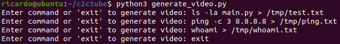
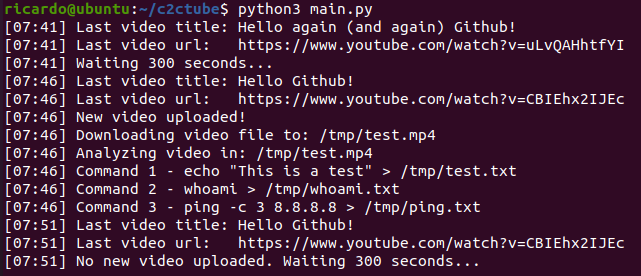
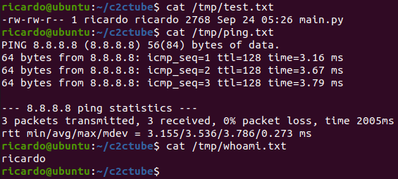

# covert-tube

Control systems remotely and execute commands by uploading videos to Youtube.

### Create a video

The videos can be created using *generate_video.py*: enter the commands and generate the video writing "exit". The video generated is called by default *output.avi* (can be updated in *config.py*): 

```
python3 generate_video.py
```




### Run the listener and upload the video to Youtube

```
python3 main.py
```

The listener will check the Youtube channel every 300 seconds by default (can be updated in *config.py*). After finding there is a new video in the channel, the video is downloaded and the commands are executed:






### Configuration

Update the *config.py* file:

- **channel_id** (Mandatory!!!): Get your Youtube Channel Id from [https://www.youtube.com/account_advanced](https://www.youtube.com/account_advanced).

- **api_key** (Mandatory!!!): To get the API key create an application ([https://console.cloud.google.com/apis/credentials](https://console.cloud.google.com/apis/credentials)) and generate an API key ([https://console.cloud.google.com/apis/credentials](https://console.cloud.google.com/apis/credentials)).

- **image_type** (Optional. Default: "qr"): Different types of images for the video. "cleartext" creates images with the words of the commands, "qr" creates QR codes.

- **upload_seconds_delay** (Optional. Default: 300): Seconds delay until checking if a new video has been uploaded.

- **generated_video_path** (Optional. Default: "output.avi"): Path of video generated with *generate_video.py*.

- **downloaded_video_path** (Optional. Default: "/tmp/test.mp4"): Path where the new video will be downloaded.

- **temp_folder** (Optional. Default: "/tmp/"): Path where images of every frame from the video are stored, with the format *image_*X*.png*.


--------------------------------------------------------------------------------------

## Create a binary


Compile the binary and clean files:

```
pyinstaller --onefile main.py
cp dist/main c2tube
rm -rf dist build
rm main.spec
```

--------------------------------------------------------------------------------------


## Motivation

Lately I have been reading about malware using Youtube for controlling their setting remotely. 

For example, Casbaneiro started to abuse YouTube to store its C&C server domains. Each video on the channels used by the thread actor contains a description and at the end of these there is a link to a bogus Facebook or Instagram url containing the C&C server domain ([Welivesecurity blog](https://www.welivesecurity.com/2019/10/03/casbaneiro-trojan-dangerous-cooking/)). 

A second example is Numando, which abuses it by encrypting the data in the title of the Youtube videos ([Welivesecurity blog](https://www.welivesecurity.com/2021/09/17/numando-latam-banking-trojan/)).

Knowing this I decided to create a PoC to test the control of remote systems uploading videos to Youtube but, instead of using the title or the description, using the content of the video. It allows to execute any command, but it could be used to change some settings. 
